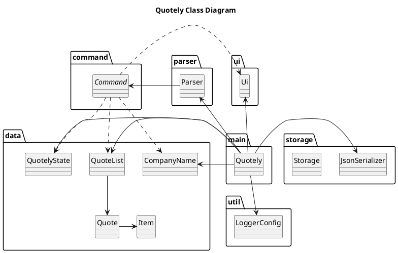

## UML diagrams (PlantUML, jar bundled in /uml)

This project bundles `plantuml.jar` inside the `/uml` folder. To create diagrams, simply `cd` into `/uml`, write a `.txt` (or `.puml`) file with PlantUML markup, and run the jar.

- [Official docs](https://plantuml.com/en/starting)

### Prerequisite

- Java 8+ installed (required to run the jar)

### Quick start (from /uml)

1) Open a terminal and change directory:

```bash
cd uml
```

2) Create a text file, e.g. `sequence-diagram.txt`:

```text
@startuml
Alice -> Bob: test
@enduml
```

3) Render the diagram to PNG (output goes to current folder by default):

```bash
java -jar plantuml.jar sequence-diagram.txt
```

You can also specify an output subfolder:

```bash
java -jar plantuml.jar -tpng -o out sequence-diagram.txt
```

Render all diagrams in the folder:

```bash
java -jar plantuml.jar -tpng -o out *.txt
```

Preview GUI (optional):

```bash
java -jar plantuml.jar -gui
```

### Using .puml files

The content is identical; `.puml` just has better editor syntax highlighting. Examples:

```bash
java -jar plantuml.jar -tpng -o out class-diagram.puml
java -jar plantuml.jar -tpng -o out *.puml
```

### Sample sources

- `/uml/sequence-diagram.txt` (created for you):

```text
@startuml
Alice -> Bob: test
@enduml
```

- `/uml/classDiagrams/quotely.txt`:




### Embedding generated images in docs

If you export to `/docs/diagrams/class`, reference them in Markdown like:

```markdown

```

### Tips

- Use `-tsvg` for scalable SVG output instead of PNG.
- Keep shared styling in a separate include and reuse via `!include`.
- Commit generated images if your docs site can’t render PlantUML at build time.

For more, see the [Official docs](https://plantuml.com/en/starting)
